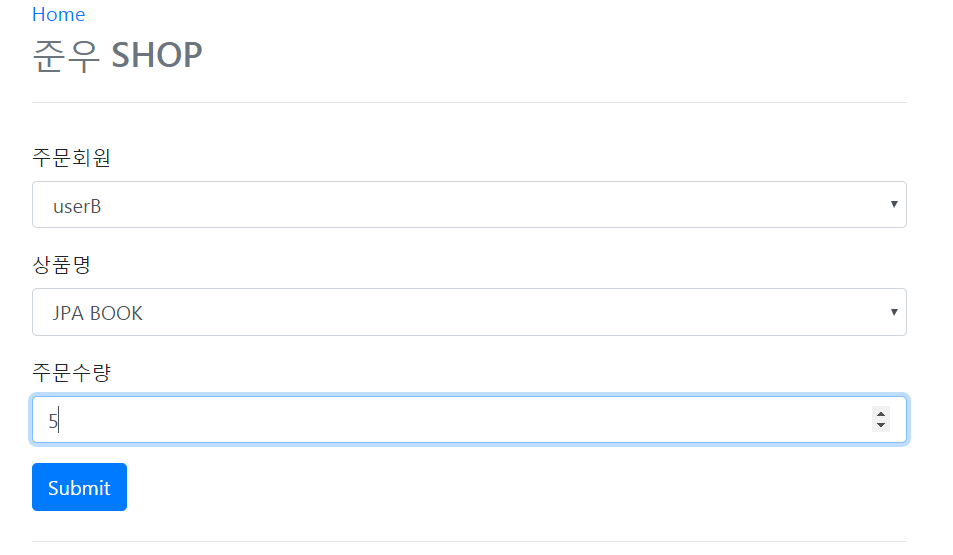
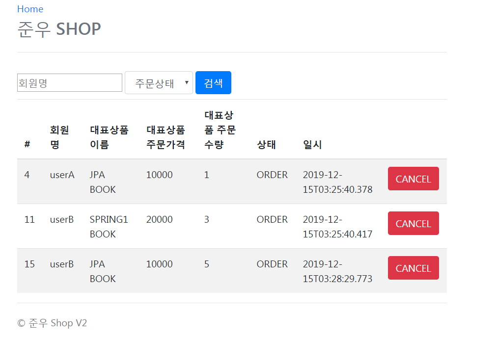

## 스프링 부트와 JPA를 활용한 미니 주문 시스템

### 개발환경
- SpringBoot, JPA, Thymleaf, REST API, H2, Bootstrap

### 주요기능
- 회원 등록
- 회원 목록조회
- 상품 등록
- 상품 목록 조회
- 상품 주문
- 주문 내역 조회
- 주문 취소
- 주문내역 조회
- 회원명 / 주문상태에 따른 주문내역 검색
- 회원등록, 수정, 조회 API
- 주문 조회 API

### 메인화면

### 회원 등록

### 회원목록 조회

### 상품 등록

### 상품 목록 조회

- 상품 정보 수정 가능

### 주문 화면

### 주문내역 조회

- Cancle버튼을 눌러 주문 취소 가능

### 주문 검색

- 회원아이디, 상품상태에 따른 주문 내역 검색
